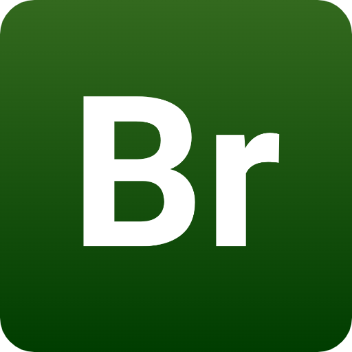

# bariumApp


<div align="center">

  
  <h1>Breaking Bad App</h1>
  
  <p>
    A Breaking Bad Quotes App. The Breaking Bad API have used.
  </p>
  
</div>

<br />

  

<!-- About the Project -->
## :star2: About the Project

<div align="left"> 
Tested on Xcode 14.1 and iOS 16.1
</div>


<!-- Prerequisites -->
### :package: Prerequisites


```
 Kingfisher
```

<!-- Contact -->
## :raising_hand_man: Contact

Kerem Safa Dirican

Linkedin: https://www.linkedin.com/in/kerem-safa-dirican/


<!-- Demo -->
## :iphone: Screenshoots

<div align="center"> 


</div>


<!-- Demo -->
## :gem: Video

<div align="center"> 

https://user-images.githubusercontent.com/50713500/205487496-def88c70-2e85-45a6-a46a-cb04ab829d78.mp4

https://user-images.githubusercontent.com/50713500/205487500-0cab81e7-4eaf-4782-bba4-4d7145def7b1.mp4

</div>
